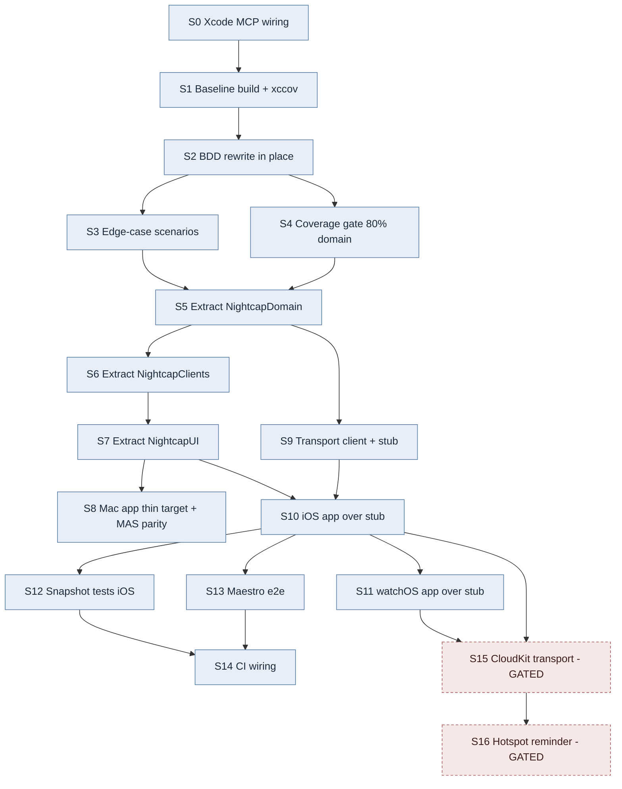

# Nightcap Expansion — SPDD Roadmap

Repo: `~/Developer/Nightcap` @ `25ee63a` (clean, 12 commits).

**You are here:** S0. Nothing started.

## Reality check

| | |
|---|---|
| Real size today | 1,281 lines Swift, 1 module, 1 target |
| Pure domain | 54 lines (`WatchedApp` 29, `LaunchAtLoginStatus` 25) |
| Logic under test | `AppFeature.swift` 171 lines, 15 XCTest cases |
| Gate to done | 2 shipping companion apps + snapshot + Maestro, all green via Xcode MCP |
| Hard blocker now | Xcode MCP not configured for this repo → cannot build or test |

## Dependency DAG

## Parallel tracks

| Track | Slices, in order |
|---|---|
| **A — Tests** | S0 → S1 → S2 → (S3 ∥ S4) |
| **B — Packaging** | S5 → S6 → S7 → S8 |
| **C — Apps** | S9 *(parallel to S6/S7)* → S10 → S11 |
| **D — Verification** | (S12 ∥ S13) → S14 |
| **E — Gated** | S15 → S16 — needs entitlement + privacy sign-off |

Real concurrency wins: **S9 alongside S6/S7**, and **S11 ∥ S12 ∥ S13** once S10 lands. Everything else is genuinely sequential — packaging can't start before characterization tests exist, apps can't start before the UI package does.

## Backlog

| ID | Slice | Blocked by | Unblocks | Est |
|---|---|---|---|---|
| S0 | Write `.mcp.json`, restart session, verify Xcode MCP tools | — | all | 10 min + restart |
| S1 | Build + run 15 tests via MCP, capture per-file xccov | S0 | S2 | 0.5 d |
| S2 | Rewrite `NightcapAppTests.swift` → Swift Testing `spec/Scenario` BDD | S1 | S3, S4 | 1 d |
| S3 | Edge cases: assertion swap-before-release, duplicate add no-op, legacy decode default, launch-at-login rollback, terminate-with-second-instance | S2 | S5 | 1 d |
| S4 | xccov script + 80% pure-domain gate | S2 | S5 | 0.5 d |
| S5 | Extract `NightcapDomain` — no AppKit import | S3, S4 | S6, S9 | 1 d |
| S6 | Extract `NightcapClients`, per-OS `#if` | S5 | S7 | 1 d |
| S7 | Extract `NightcapUI` shared views | S6 | S8, S10 | 1 d |
| S8 | Mac app → thin target, verify entitlements/LSUIElement parity | S7 | — | 0.5 d |
| S9 | `MacStateTransportClient` protocol + stub live value | S5 | S10 | 1 d |
| S10 | iOS app target, TCA over stub | S7, S9 | S11–S13 | 2 d |
| S11 | watchOS app target over stub | S10 | S15 | 2 d |
| S12 | Snapshot tests, iOS | S10 | S14 | 1 d |
| S13 | Maestro e2e flows | S10 | S14 | 1 d |
| S14 | CI runs macOS + iOS + watch + Maestro | S12, S13 | — | 1 d |
| S15 | **GATED** CloudKit transport, entitlements, PRIVACY.md rewrite | S10, S11 | S16 | 3 d |
| S16 | **GATED** Hotspot reminder — `NWPathMonitor` → companion | S15 | — | 1 d |

## PR stack

Each independently green and reviewable:

1. **PR1** = S0–S4 — test rewrite + coverage gate. Zero production-code change. The one worth upstreaming.
2. **PR2** = S5–S8 — package extraction. Behavior-identical Mac app.
3. **PR3** = S9–S10 — iOS app on stub.
4. **PR4** = S11 — watchOS.
5. **PR5** = S12–S14 — verification infra.
6. **PR6** = S15–S16 — only after explicit sign-off.

S15/S16 dashed for a reason: they add a network entitlement to a sandboxed App Store app whose listing promises zero network calls. Separate decision, last.
